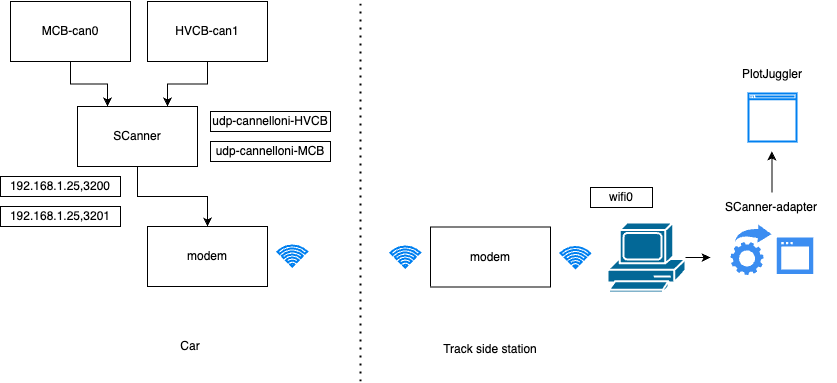

# SCanner-adapter
Cannelloni UDP to JSON stream translator

## General schema


## How to use the app: Cannelloni mode

### CONFIG file
To configure the parameters of the program you have to create a `CONFIG.txt` file with the following parameters:

Canneelloni mode:
```txt
MODE=Cannelloni
PATH_DBC_CAN0=Path
PATH_DBC_CAN1=Path
UDP_PORT=5000
IP_SCANNER=8.8.8.8
CAN0_PORT=9600
CAN1_PORT=9601
```
Physical CAN mode:
```txt
MODE=Physical
PATH_DBC_CAN0=Path
PATH_DBC_CAN1=Path
UDP_PORT=5000
CAN_SOCKET0=can0
CAN_SOCKET1=can1
```
The `PATH_DBC_CAN0` and `PATH_DBC_CAN1` parameters are the paths to the DBC files of the CAN0 and CAN1 buses respectively. The `IP_SCANNER` parameter is the IP address of the scanner. The `CAN0_PORT` and `CAN1_PORT` parameters are the ports of the CAN0 and CAN1 buses respectively. The `UDP_PORT` parameter is the port of the local UDP server. The `CAN_SOCKET0` and `CAN_SOCKET1` parameters are the names of the physical CAN0 and CAN1 sockets respectively (only supported in Linux).

## How to use the app: Physical CAN mode
This mode supports the input from physical `can0` and `can1` buses. You can select the bitrate and the DBC file for each bus. The output is a JSON stream that is sent to a UDP server.

## How to initialize locally
### Install dependencies and run
```bash
pip install -r requirements.txt
python main.py
```

## Build executable
```bash
pyinstaller --name SCannerAdapter  main.py --onefile --windowed
```

## Publish new release
### Script bash
Simply run the script `deploy.sh` with the version as argument.
```bash
chmod +x deploy.sh
./deploy.sh 1.0
```

### Manual
Replace 1.0 with your version.
```bash
git add .         
git commit -m "v1.0"  
git tag -a v1.0 -m "Version 1.0"      
git push origin master --tags   
```   
For a complete guide on how it works and how to publish a new release, check [this repo](https://github.com/Paolo-Beci/pyinstaller-all-os-gh-action).

## Tech stack
- Python 3.12.2
- [Tkinter](https://docs.python.org/3/library/tkinter.html)
- [Pyinstaller](https://www.pyinstaller.org/)
- [CannelloniPy](https://github.com/squadracorsepolito/cannelloniPy)
- [Cannelloni](https://github.com/mguentner/cannelloni)
- [Cantools](https://pypi.org/project/cantools/)
- [PlotJuggler](https://github.com/facontidavide/PlotJuggler)
